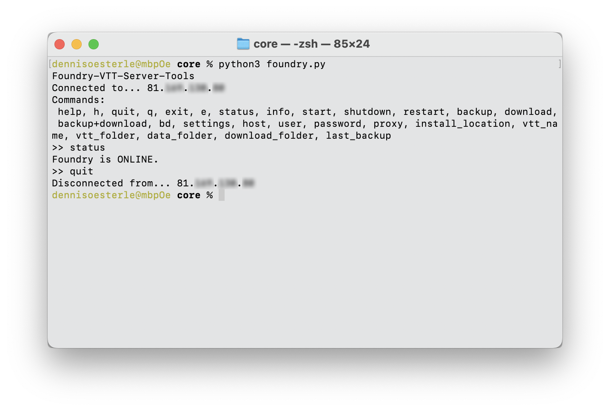

# Foundry VTT Server Tools
Helpful tools for a Linux Foundry VTT Server.

Requirements:
* Python 3.11
* paramiko

Run Server Tools from Terminal:
```
python foundry.py
```
You also need to edit the cache.json file.

* host: server ip address
* user: user name
* password: user password
* install_location: foundry install folder on server i. e. "/home/foundry/"
* vtt_name: name of pm2 instance
* vtt_folder: foundry folder name
* data_folder: name of data folder
* download_folder: path to local download folder



